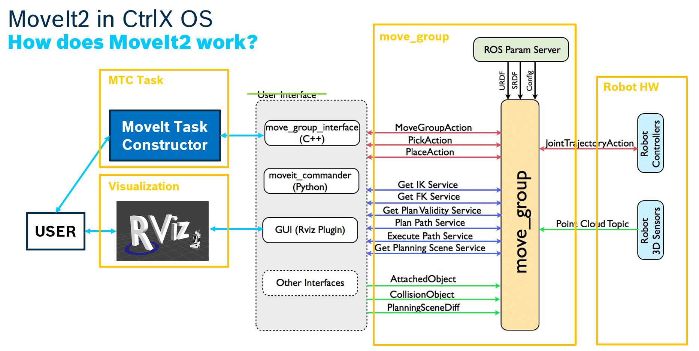
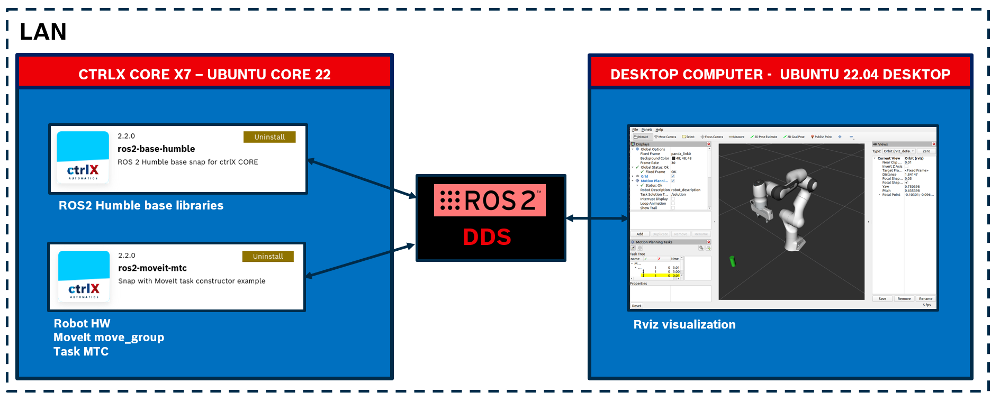
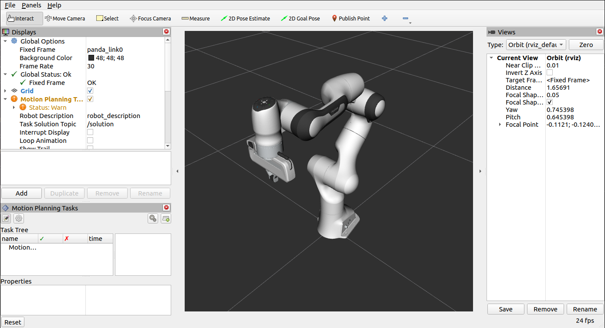
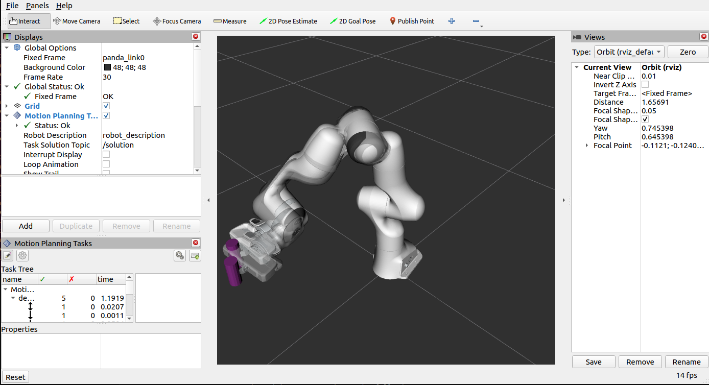

[](https://opensource.org/licenses/MIT)

# MoveIt2, MTC and  ros2_control for CtrlX OS
A ROS2 Humble snap for CtrlX OS containing a demo example for robot trajectory planning using ros2_control, MoveIt2 and MoveIt Task Constructor.

This project is based on the [example](https://moveit.picknik.ai/main/doc/tutorials/pick_and_place_with_moveit_task_constructor/pick_and_place_with_moveit_task_constructor.html#) available in the MoveIt2 official tutorials. It shows how to use the MTC API to plan a complex gripping task with a Panda Robot.

The original project is generally licensed under: 

[](https://opensource.org/license/bsd-3-clause)

See specific licenses declaration for each package under ./src/\<package_name> folder.

## Authorship
Author: Raul Cruz-Oliver

Date and place: January 2024, Switzerland

Contact: raul.cruz.oliver@gmail.com

## Resources official documentation
The official updated documentation for the libraries used in this example can be found under the following links:

[ros2_control](https://control.ros.org/master/index.html), [MoveIt2](https://moveit.picknik.ai/main/index.html) and [MoveIt Task Constructor](https://github.com/ros-planning/moveit_task_constructor/tree/humble)


## Introduction
This example has been built for ROS2 Humble, being this the latest LTS ROS2 version at the current moment. It is build for CtrlX OS 2.04, i.e. a system containing core ubuntu 22. CtrlX OS is running on a CtrlX CORE X7, with a amd64 processing architecture.

For this example to work it is assumed that ros2-base-humble snap is running in CtrlX OS. The source code to compile such base snap is also available in the repository. 

This project is based on the [example](https://moveit.picknik.ai/main/doc/tutorials/pick_and_place_with_moveit_task_constructor/pick_and_place_with_moveit_task_constructor.html#) available in the MoveIt2 official tutorials. It shows how to use the MTC API to plan a complex gripping task with a Panda Robot.

This example contains 4 main parts, that are related with each other as it can be seen in the following figure.

.

- <strong>Robot HW</strong>. In real life it will correspond to the actual controllers that move the machine. In this example, the Panda Robot HW is substituted with a fake one, and such hardware is controlled using ros2_control package. Actually, it is common in many robotic platforms to operate the real HW using ros2_control as well. 

- <strong>move_group</strong>. It is the main node from the MoveIt library. It is responsible for the planning task (IK, FK, etc.). It gets information from the robot (sensors), combine it with the user input and produce a solution that is sent back to the robot in order to be executed.

- <strong>MoveIt Task Constructor (MTC)</strong>. Interacting directly with the move_group node is hard when we are dealing with complex tasks. MTC is simply a C++ API that helps the user formulate, in a high-level language, complex tasks as a sequence of stages. 

- <strong>Visualization</strong>. Since in this example we are working in simulation, we need a visualization tool to see what is happening. The choice here has been the well-known Rviz. 

The RobotHW control, the move_group and the MTC are running in CtrlX OS, whereas the visualization will run in a Desktop Computer. Such a topology is shown in the next figure:

.

## How to build the project your self?
Building this project means producing the snap that can be later installed in CtrlX OS.

It is designed to be built in Ubuntu Desktop 22.04 LTS, running ROS2 Humble and Moveit2.

First you need to install the neccesary dependencies in your system.

### 1. Install ROS2 humble
For this you can follow the Debian installation from the [official guide](https://docs.ros.org/en/humble/Installation/Ubuntu-Install-Debians.html)

### 2. Install MoveIt2 and ros2_control
As stated in the [official documentation](https://moveit.ros.org/install-moveit2/binary/) you can install the binaries with:
```bash
sudo apt install ros-humble-moveit
```
This meta-package includes everything that is needed from MoveIt.

Install ros2_control
```bash
sudo apt install ros-humble-ros2-control
```

Install ros2_controllers
```bash
sudo apt install ros-humble-ros2-controllers
```

### 3. Open this project
This project includes the MoveIt Task Constructor library. It is a simple clone of what can be found in [the humble-branch official repository](https://github.com/ros-planning/moveit_task_constructor/tree/humble). This package is licensed under:

[](https://opensource.org/license/bsd-3-clause)

See corresponding LICENSE declaration in the ./src/moveit_task_constructor folder in this directory.


Moreover, this repository includes the mtc_demo package, which indeed uses the functionalities of MTC to program a robot task. This package is based on the official MoveIt2 tutorial, licensed under:

[](https://opensource.org/license/bsd-3-clause)

See corresponding LICENSE declaration in the ./src/mtc_demo folder in this directory.

### 4. Create the snap
Install snapcraft in your system:
```bash
sudo snap install snapcraft --classic
```

Now, your system should be ready for snapcrafting. The process have been automated for you. Simply call:

```bash
./build-snap.sh
```
Please do it in a fresh terminal, i.e. without sourcing any ROS2. Be careful you do not have it automatically sourced in ./bashrc.

## How to run the project?
For this demo version it is assumed you have a SSH connection with the X7. Further developments will make an app that can run without this requirement.

### 1. Install the apps   
Instal ros2-base-humble and ros2-moveit-mtc in your ctrlX OS. Remember to allow unknown sources.

### 2. Connect the devices in the same LAN
Connect the X7 and the Desktop Computer in the same local Network. This will allow ROS2 to exchange information using the DDS.

### 3. Start the robot
Open a SHH connection with your X7 and run the following:
```bash
sudo ros2-moveit-mtc.initALL 
```

You could check from your Desktop Device the nodes that are now running. Do not forget to source ROS2 in this particular terminal for the "ros2 node" command to work.
```bash
user@computer:~$ source /opt/ros/humble/setup.bash

user@computer:~$ ros2 node list
/controller_manager
/joint_state_broadcaster
/move_group
/move_group_private_94150218323152
/moveit_simple_controller_manager
/panda_arm_controller
/panda_hand_controller
/robot_state_publisher
/static_transform_publisher
/transform_listener_impl_55a10e579ca0
```

### 4. Start the visualization 
There is a .sh file that sources the terminal and launches Rviz:

```bash
./visualization_demo.sh 
```

You should see the Panda robot in a ready position. Such ready pose is the one that can be seen in the following picture, if the arm is not in that exact pose it means that there was some problem starting the robot in the ctrlX OS, i.e. simulation does not find the controllers.

.

NOTE: You can also start the visualization first, then you will see the robot in a non-ready pose, once you start the robot in ctrlX OS, the robot will go to the ready pose.

### 5. Launch the MTC task
Open a new SHH connection with your X7 and run the following:
```bash
sudo ros2-moveit-mtc.task 
```
You should see the robot executing the task.
.

If you inspect the nodes now, among all the Rviz nodes, you will find a new node called /mtc_node. It is the resposible to translate the high-level commands from MTC and sending them to move_group.

### 5. Shutdown the processes
Please, before closing the terminal that hold the SHH connections, terminate the processes with Ctrl^C. Otherwise, the system will be running for ever in the CtrlX OS and this could lead to problems in the future. If you forget to shutdown the terminals, most likely you will need to uninstall the ros2-moveit-mtc snap and install it again, note that you need to uninstall and install, and not simply reinstall/update.