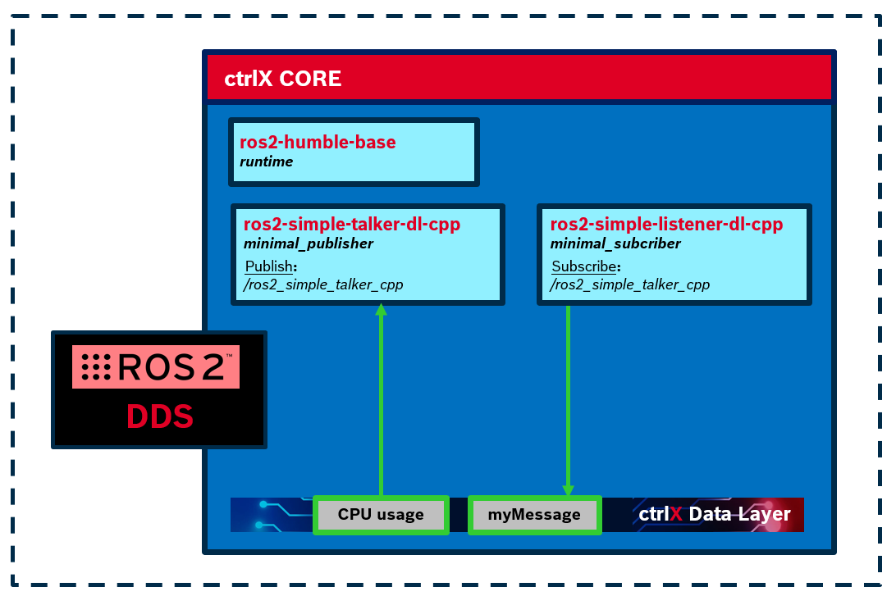

# Non-real time connection with Datalayer with C++ - collection

## Developer information Information

**First version**: Bosch Rexroth [official ROS2-SDK](https://github.com/boschrexroth/ctrlx-automation-sdk-ros2).

**Revisited:** Raul Cruz Oliver (raul.cruz.oliver@gmail.com)

**Date and place:** October 2024, Buttikon, CH

## Description
This collection contains the following snaps:

### listener-nrt-dl-cpp
This snap contains a ROS2 node that subscribes to a topic and writes the information to the datalayer using a non-real time mechanism.

### talker-nrt-dl-cpp
This snap contains a ROS2 node that publishes a topic with information read from the datalayer using a non-real time mechanism.

## Architecture overview

## License
Snap collection belonging to ctrlx_ros2 repository, ergo protected under license MIT.