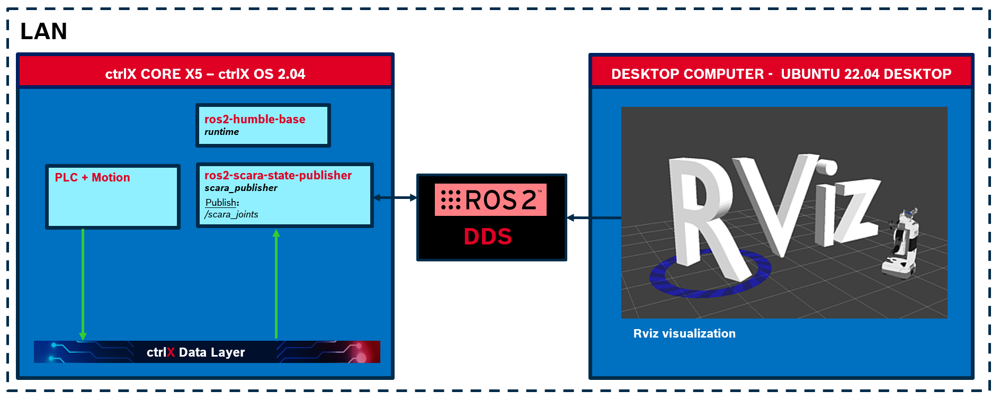
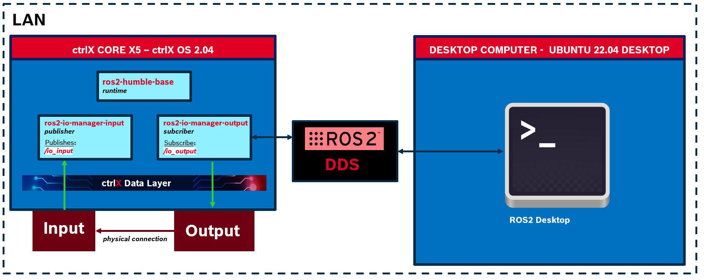
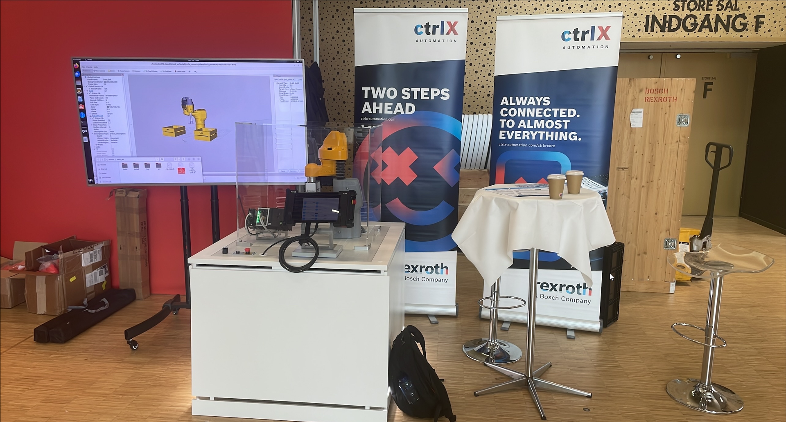

# ROSCon 24 snap - collection

## Developer information Information

**Author:** Raul Cruz Oliver (raul.cruz.oliver@gmail.com)

**Date and place:** October 2024, Buttikon, CH

## Description
This set of snap packages have been developed for the ROSCon 24 in Odense, Denmak. This collection contains the following snaps:

### scara-publisher-cpp:
This snap contains a ROS2 node that publishes in a topic the actual position of a SCARA robot joints. The published information is used by a external ROS2 application to visualize the robot in Rviz. The external application can be found [here](https://github.com/rcruzoliver/ctrlx_roscon24).

### io-manager-input-cpp
This snap contains a ROS2 node that publishes a topic with information read from the DL about the state of a harware input.

### io-manager-output-cpp
This snap contains a ROS2 node that subcribes to a externally published topic, written such information is a specifc address in the DL to trigger a hardware output.

## Scara example topologie overview

## IO Manager overview

## Faire stand

## License
Snap collection belonging to ctrlx_ros2 repository, ergo protected under license MIT.